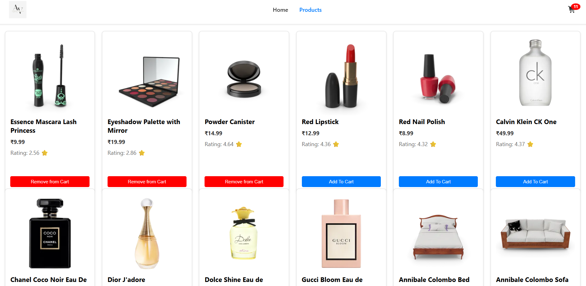
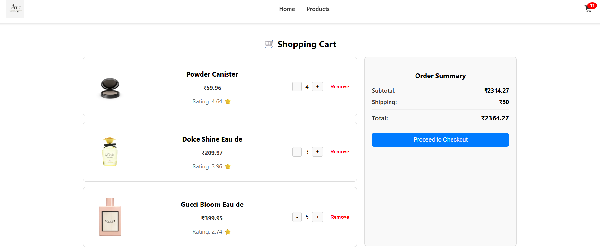

# 🛒 Shopping Cart Application


## 📌 Overview
A **React + Redux Shopping Cart** application with dynamic quantity updates, price calculation, and localStorage persistence. Fully responsive with a clean UI.

---

## ✅ Features
- Add products to cart
- Increase or decrease quantity
- Remove products from cart
- Dynamic subtotal and total calculation
- Persist cart data using localStorage
- Responsive design using Flexbox

---

## 🛠 Tech Stack
- **React** (Hooks)
- **Redux Toolkit**
- **CSS Flexbox**
- **LocalStorage**

---

## 📂 Project Structure
```
src/
 ├── components/
 │    └── ProductCart.jsx      # Shopping Cart Component
 ├── Redux/
 │    └── cartSlice.js         # Redux Slice for Cart
 ├── styles/
 │    └── ProductCart.css      # Styling for Cart UI
 └── App.js                    # Main App Component
assets/
 └── images/                   # UI preview images for README
```

---

## ⚙️ Installation & Setup
```bash
git clone https://github.com/virensahu/shopping-Cart.git
cd shopping-Cart
npm install
npm start
```

---

## 🔑 Redux Actions
- `addItemToCart(item)` → Add new product
- `removeFromCart(id)` → Remove product
- `increseQuantity(id)` → Increase quantity
- `decreseQuantity(id)` → Decrease quantity

---

## 📱 Responsive Layout
- **Desktop:** Product details left, Order summary right
- **Mobile:** Stacks vertically

---

## ✅ Future Enhancements
- Confirmation popup before removing items
- Toast notifications for cart updates
- API integration for product data
- Checkout flow

---

## 📸 UI Preview



> **Note:** Place your UI screenshots inside `assets/images` folder at the root of the project so GitHub can render them correctly.

---

## 🤝 Contributing
Fork this repo and submit pull requests for improvements.

---

## 📜 License
Licensed under the **MIT License**.
